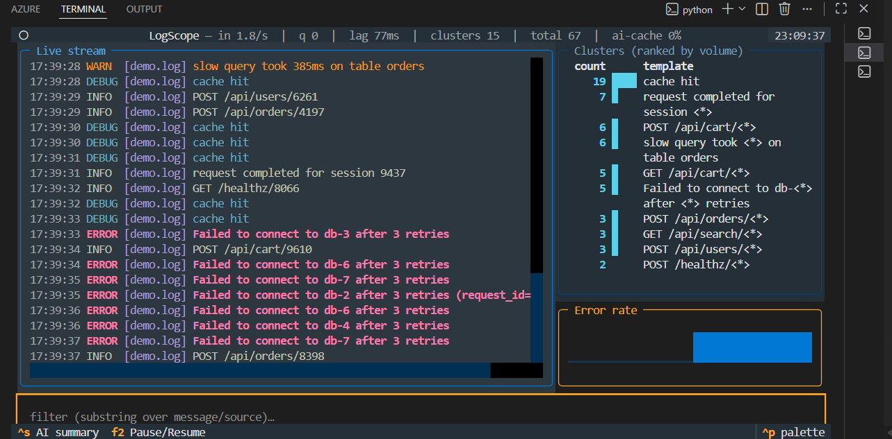
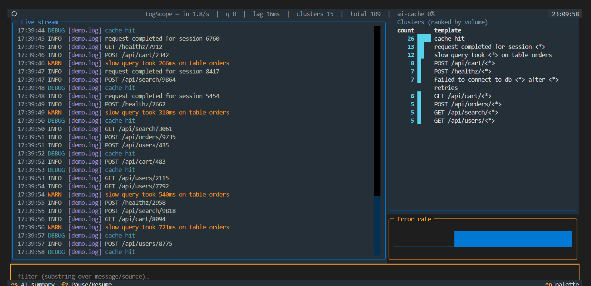
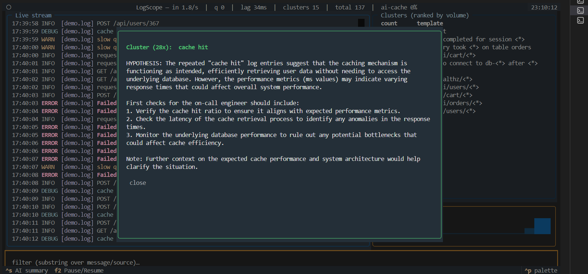

# LogScope

A terminal tool for reading and making sense of logs, written in Python.

LogScope follows your log files live, groups similar lines together so you see
patterns instead of noise, warns you when errors spike, lets you search your
history, and can optionally suggest what went wrong using AI.

[](https://github.com/chinmai-sd-123/LogScope/actions/workflows/ci.yml)


<p align="center">
  
  <br>
  <em>Live tailing with a colorized stream, ranked clusters, and an error-rate graph.</em>
</p>

## The problem

When something breaks, you usually open a log file and scroll through thousands
of lines looking for what matters. Tools like `tail` and `grep` show you the
lines, but they do not:

- **Group repeated lines.** One bug can print almost the same error thousands of
  times. You want to see "this error, 10,432 times" as a single row.
- **Show error spikes.** A sudden jump in errors is usually the real signal.
- **Combine logs from several places** into one timeline.

LogScope does these things. I built it to learn how real log tools work on the
inside (file reading, async, indexing, clustering, networking), not to replace
big systems like Datadog or Loki.

## What it does

- Follows one or more log files live, and keeps working when a log file is
  rotated.
- Groups similar lines into patterns with counts, using the Drain algorithm.
- Detects error spikes with simple, explainable statistics, shown as a small
  graph.
- Full-text search with a small query language.
- Can collect logs from many machines into one place (agents and a server).
- Optional AI summary of a problem cluster. The tool works fine without it.
- Shows its own stats: events per second, queue depth, lag, and query speed.

## In action

Noisy lines collapse into a short list of patterns. A failing code path that
prints thousands of near-identical lines becomes one row with a count, and the
error-rate graph spikes during the incident.

<p align="center">
  
</p>

Press `ctrl+s` on the top cluster to open a popup with a plain-English guess at
the root cause and the first things to check. It is cached, time-limited, and
fully optional.

<p align="center">
  
</p>

## How it is built

The system is a pipeline. Each stage is small and tested on its own.

```
 SOURCES         INGEST          PARSE          PROCESSING            SINKS
 files,    -->   tail,    -->    line to   -->  index (FTS5)    -->   live view,
 agents         batch,          LogEvent       cluster (Drain)       search,
                backpressure                   anomaly (z-score)     storage
                                                     |
                                                     v
                                                 AI summary
                                               (optional, cached)
```

It runs on a single `asyncio` event loop. The stages are connected by size-limited
queues, which give backpressure for free: when a queue is full the producer waits,
so a fast log source slows itself down instead of using up all the memory.

The reasons behind each design choice are written down in
[docs/decisions.md](docs/decisions.md).

## Distributed mode

If your app runs on more than one machine, each machine has its own log file.
Normally you would log into each box to read them. LogScope collects them into
one place using two small programs.

```
   Machine A:  app.log  -->  [agent]  --\
                                         \
   Machine B:  app.log  -->  [agent]  ----+--TCP-->  [server]  -->  one database
                                         /
   Machine C:  app.log  -->  [agent]  --/
```

- An **agent** runs on each machine. It tails the local log and sends new lines
  to the server in batches.
- The **server** receives lines from all agents and stores them in one database.

The useful part is what happens when the server goes down. The agent keeps the
lines it could not send, retries with growing wait times, and delivers them once
the server is back. Each line has a stable id, so a resend is never stored twice.
The result is that no lines are lost and none are duplicated.

What you see when you run it:

```
# terminal 1 (server)
$ logscope serve
... logscope.server listening on ('0.0.0.0', 9099)
... logscope.server agent connected: ('127.0.0.1', 54012)

# terminal 2 (agent)
$ logscope agent app.log --server 127.0.0.1:9099 --from-start
... logscope.agent connected to 127.0.0.1:9099
```

You read the collected logs with `logscope search` (see below). The server is a
headless collector, so there is no separate screen for it.

## Quickstart

```bash
git clone https://github.com/chinmai-sd-123/LogScope.git
cd LogScope
python -m venv .venv
. .venv/Scripts/activate        # Windows
# source .venv/bin/activate     # macOS or Linux
pip install -e ".[dev]"
```

Try it on a quick sample log, or point it at any log file you already have:

```bash
python -c "import random; print('\n'.join(('ERROR Failed to connect to db-%d after 3 retries' % random.randint(1,9)) if random.random()<0.2 else ('INFO GET /api/users/%d 200' % random.randint(1,9999)) for _ in range(800)))" > sample.log

logscope tail sample.log --from-start
```

In the live view: type to **filter**, **f2** to pause or resume, **ctrl+s** for
an AI summary of the top cluster, **ctrl+c** to quit.

## Usage

```bash
# live view over one or more files (also saves them for search)
logscope tail app.log worker.log

# search the saved history
logscope search 'level:error source:api last:1h "timeout"'

# distributed: one collector plus agents on other machines
logscope serve
logscope agent /var/log/app.log --server host:9099
```

AI summaries are optional. Copy `.env.example` to `.env` and set
`OPENAI_API_KEY` to turn them on. Without a key the tool works fully and the
summary popup just says it is unavailable.

### Query language

```
level:error source:api last:15m "connection timeout"
```

All terms must match (they are ANDed together). `level:error` means severity at
ERROR or worse, `last:15m` is a time window, and quoted or bare words are full-text
matches. The same parsed query runs two ways: as a SQL query over history, and as
a Python check over the live stream.

## Run it with Docker

This starts one server and two agents on your machine, so you can see the
distributed setup without real extra machines:

```bash
docker compose up --build
# in another terminal, search what the server collected:
docker compose exec server logscope search 'level:error "Failed to connect"'
```

## Testing

```bash
pytest
```

The tests focus on the parts where bugs hide: the parser (including broken
input), the query lexer and parser, Drain clustering, anomaly detection, the
network protocol, and the agent and server together (including crash recovery).
The live view has a headless smoke test. There are 100+ tests.

## Design decisions

Short reasons for the choices that matter: a single `asyncio` loop, an immutable
event type, SQLite with FTS5, Drain written by hand instead of a library,
statistics instead of machine learning for spikes, at-least-once delivery with
de-duplication, and AI that is optional only. See
[docs/decisions.md](docs/decisions.md).

## Limitations

- `serve` is a headless collector. You read its data with `logscope search`.
- The query language only supports AND for now (OR, NOT, and brackets are planned).
- Cluster ids are per run, not stable across restarts.
- You cannot pipe a live program straight into the view, because the view needs
  the keyboard. Write to a file and tail the file instead.

## License

MIT. See [LICENSE](LICENSE).
